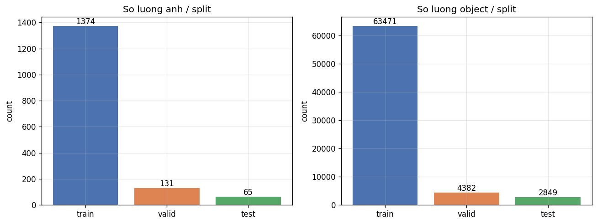
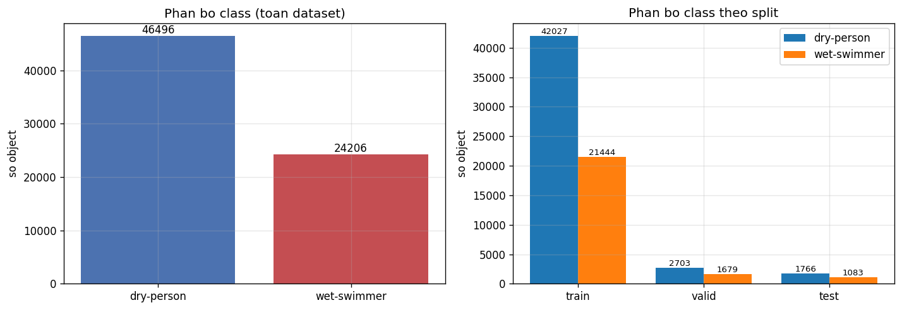
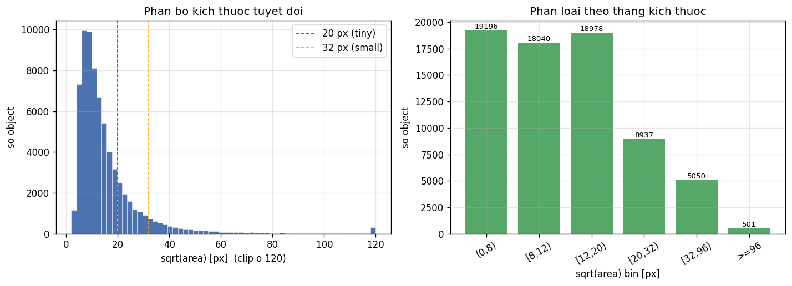
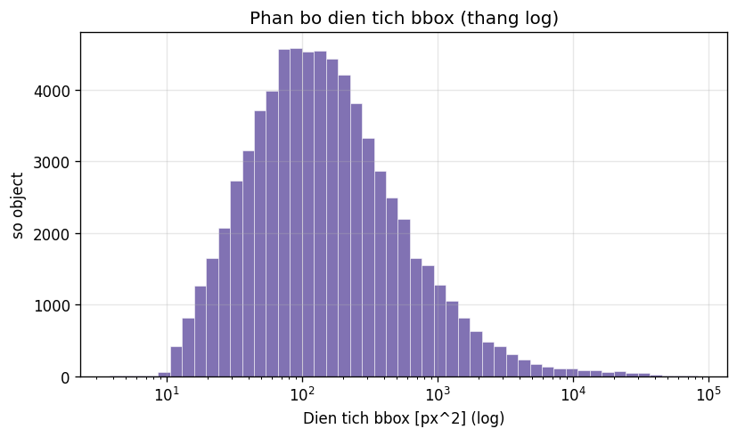
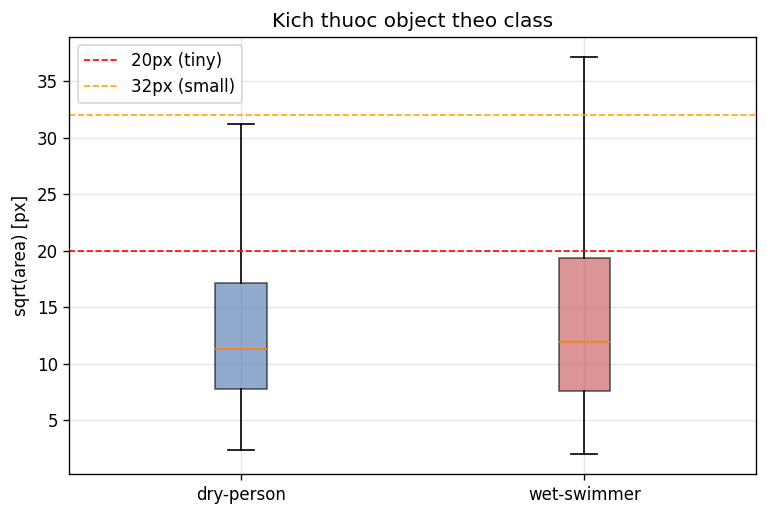
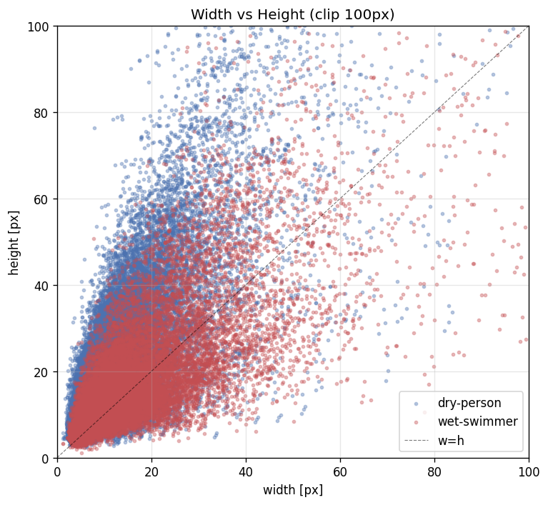
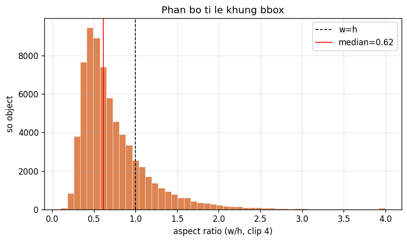
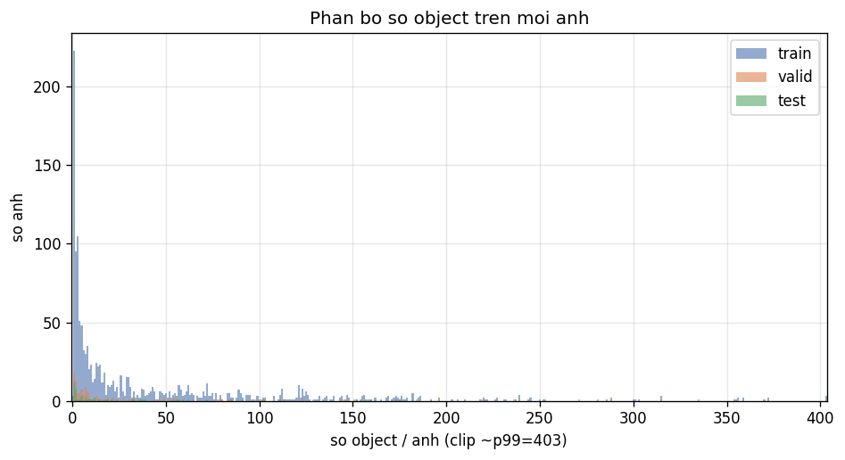
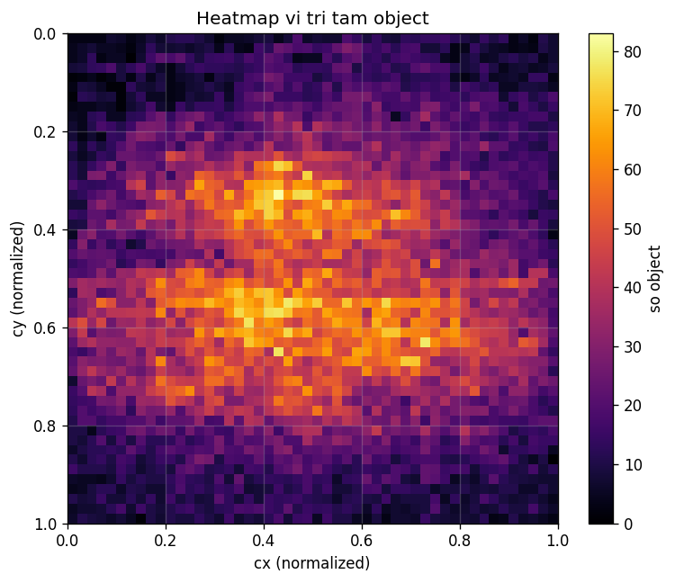

# Bao cao EDA - Dataset TinyPerson

> Sinh tu dong boi `eda/eda_tinyperson.py`. Moi so lieu duoc tinh truc tiep tu file anh va nhan trong `data/`.

## 1. Tong quan

- **Tong so anh**: 1,570
- **Tong so object (instance)**: 70,702
- **So class**: 2 -> `dry-person`, `wet-swimmer`
- **Anh khong co object (background)**: 3
- **Trung binh object / anh**: 45.03
- **Dinh dang nhan**: YOLO polygon (da chuyen sang bounding box de thong ke)

## 2. Phan chia train / valid / test

| Split | So anh | So object | Background | obj/anh (TB) | obj/anh (max) |
|-------|-------:|----------:|-----------:|-------------:|--------------:|
| train | 1,374 | 63,471 | 3 | 46.19 | 730 |
| valid | 131 | 4,382 | 0 | 33.45 | 271 |
| test | 65 | 2,849 | 0 | 43.83 | 335 |
| **Tong** | **1,570** | **70,702** | **3** | - | - |

## 3. Phan bo class (mat can bang)

| Class | train | valid | test | Tong | Ti le |
|-------|------:|------:|------:|------:|------:|
| `dry-person` | 42,027 | 2,703 | 1,766 | 46,496 | 65.8% |
| `wet-swimmer` | 21,444 | 1,679 | 1,083 | 24,206 | 34.2% |

> **Nhan xet**: lop `dry-person` chiem uu the, ti le mat can bang khoang **1.9:1**. Can luu y khi train (vd: class weights / focal loss).

## 4. Kich thuoc object (dac thu tiny object)

Kich thuoc tinh bang `sqrt(dien tich bbox)` theo pixel tuyet doi.

| Chi so | Toan dataset |
|--------|-------------:|
| sqrt(area) trung binh | 15.7 px |
| sqrt(area) trung vi | 11.5 px |
| sqrt(area) nho nhat | 2.0 px |
| sqrt(area) lon nhat | 288.5 px |
| Object "tiny" (< 20px) | **79.5%** |
| Object "small" (< 32px) | **92.1%** |

Phan loai theo thang kich thuoc (sqrt area):

| Bin (px) | So object |
|----------|----------:|
| (0,8) | 19,196 |
| [8,12) | 18,040 |
| [12,20) | 18,978 |
| [20,32) | 8,937 |
| [32,96) | 5,050 |
| >=96 | 501 |

> **Nhan xet**: 92% object nho hon 32px - day dung la bai toan tiny/small object detection. Cac model cau hinh mac dinh (anchor/stride lon) se bo sot phan lon muc tieu; can chu y feature map do phan giai cao, anchor nho.

## 5. Hinh dang & ti le khung

## 6. Phan bo khong gian & mat do

## 7. Kich thuoc anh

| Split | Cac kich thuoc (WxH : so anh) |
|-------|------------------------------|
| train | 1920x1080:936, 1280x720:192, 2048x1152:72, 1920x1072:51, 1024x768:24 |
| valid | 1920x1080:94, 1280x720:15, 1920x1072:5, 2048x1152:4, 1600x900:2 |
| test | 1920x1080:39, 1280x720:12, 2048x1152:3, 2048x1536:2, 1200x773:1 |

## 8. Tom tat & khuyen nghi

1. Dataset gom **1,570 anh / 70,702 object**, 2 lop nguoi (`dry-person`, `wet-swimmer`).
2. **Mat can bang lop ro ret** - can class weighting hoac oversampling lop thieu.
3. **~92% object la tiny/small (<32px)** - uu tien kien truc giu do phan giai cao (FPN/HRNet), anchor/label-assignment cho object nho (vd RFLA).
4. Co **3 anh background** - giup giam false positive khi train.
5. File du lieu kem theo: `summary.json`, `instances.csv`, `images.csv` de phan tich sau.
