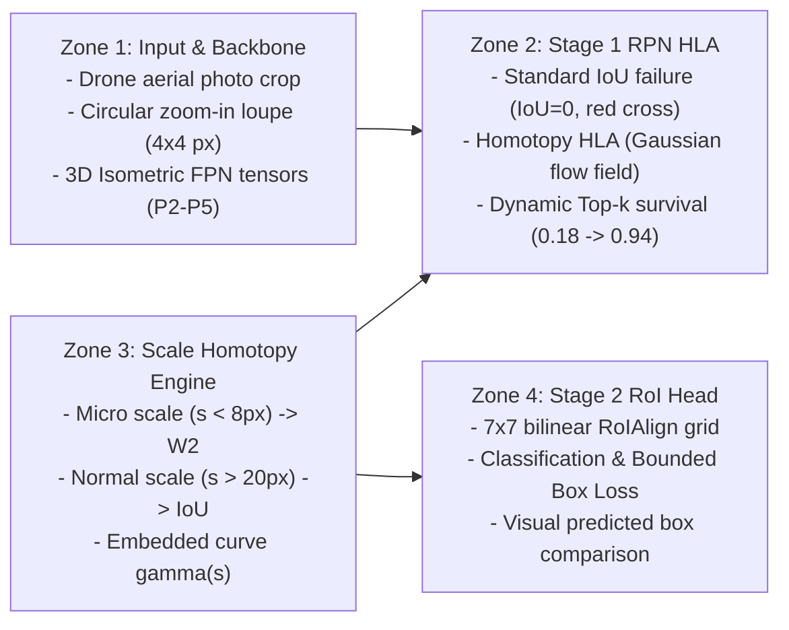

# Visual-First Architecture Diagram Design (PaperBanana Standard)

## 1. Design Principles (NeurIPS 2025 Pastels)
Following Google Research's **PaperBanana (arXiv:2601.23265)** and NeurIPS 2025 graphic design standards:
* **"Soft Tech & Scientific Pastels" Palette**: Light desaturated pastels (10–15% opacity) to encapsulate pipeline stages without visual fatigue.
  * Zone 1 (Input & Backbone): Pale Ice Blue (`#F0F7FF`)
  * Zone 2 (Stage 1 RPN HLA): Cream / Soft Amber (`#FFFBEB`)
  * Zone 3 (Scale Homotopy Controller): Pale Lavender (`#F5F3FF`)
  * Zone 4 (Stage 2 RoI Head): Mint / Sage Green (`#F0FDF4`)
* **Zero Text Dumping**: Paragraphs and bullet text are replaced by intuitive visual metaphors (tensor cuboids, vector fields, curve plots).
* **Strict Coordinate Normalization**: Matplotlib master axis locked to $[0, 100] \times [0, 100]$ with `aspect="auto"` to preserve crisp aspect ratios across embedded drone imagery and sub-plots.

## 2. Component Architecture (Figure 5)

## 3. Visual Artifacts
* Master Vector PDF: [`journal/figures/fig5_pipeline_architecture.pdf`](file:///c:/Users/ADMIN/_Project/tiny-object-detection/journal/figures/fig5_pipeline_architecture.pdf)
* High-Resolution PNG (300 DPI): [`journal/figures/fig5_pipeline_architecture.png`](file:///c:/Users/ADMIN/_Project/tiny-object-detection/journal/figures/fig5_pipeline_architecture.png)
* Source Script: [`journal/tools/render_paperbanana_hwiou_diagram.py`](file:///c:/Users/ADMIN/_Project/tiny-object-detection/journal/tools/render_paperbanana_hwiou_diagram.py)
